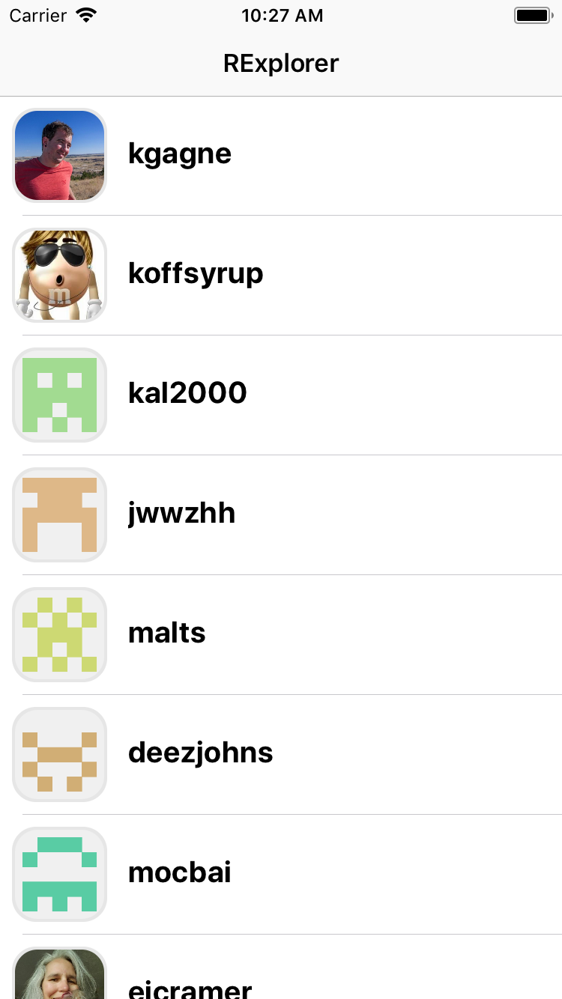
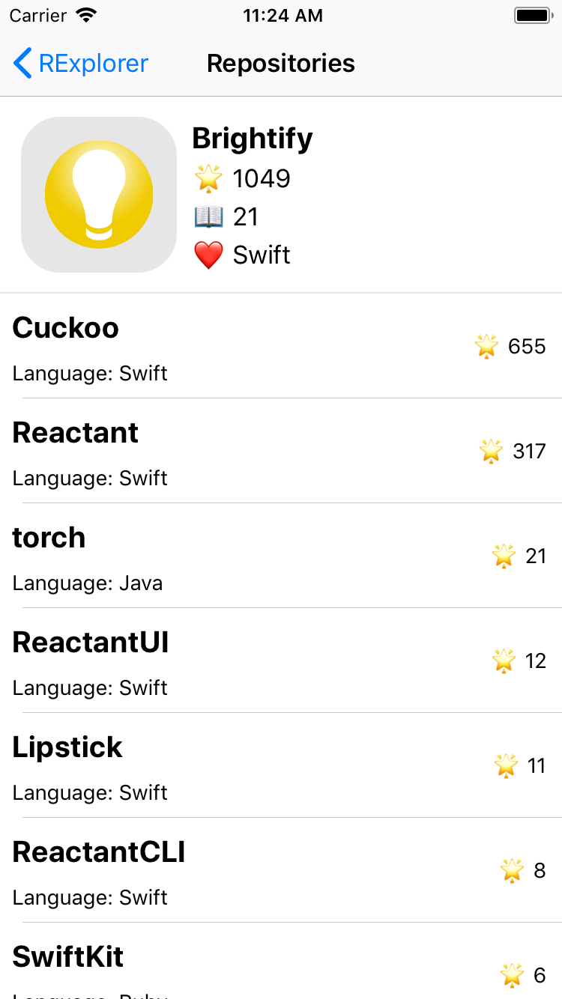

[author]: https://github.com/MatyasKriz

# GitXplorer
This application is part of a tutorial for learning the Reactant architecture. To head over to this particular's application tutorial, [check this link out](https://docs.reactant.tech/tutorials/GitXplorer/explorer.html).

Here are some screens from the application:

    It looks something like this:  
    
       
    

---

If you've upgraded the application, don't hesitate and create a Pull Request.

## Author
[Matyas Kriz][author]

## License
This tutorial code is licensed under MIT license.
